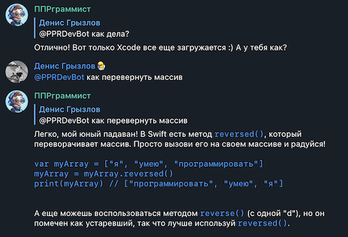

## ППРграммист

Помощник по программированию, которого можно добавлять в разные чаты по разным языкам программирования.
Бот будет отвечать только в те чаты, которые указаны в config.json, которые надо добавлять туда вручную.

Бот будет отвечать немного с юмором, но довольно дружелюбно. Максимально кратко и с маленькими кусками кода, чтобы не засорять переписку в чате.
С помощью gpt3.5-turbo, бот будет оставаться в контексте одного языка/технологии в пределах одного чата, тем самым добавляя его в разные чаты можно давать ему разные "персоналии".

## Для настройки

- Укажите ключ OpenAI, токен Telegram бота.
- Пропишите свой user id, куда бот будет слать оповещения при добавлении в новый чат
- Заполните chatIdLanguageMap списком chat.id (и topic id) и языками программирования, по которому он должен помогать

```js
{
    "openai_key": "<ваш ключ OpenAI>",
    "telegram_bot_token": "<токен телеграм бота>",
    "bot_name": "@YourBotName",
    "admin_id": 123456, // user id администратора
    "chatIdLanguageMap": { 
      "-978504211": "Swift", // обычный чат
      "-3992393231": { // чат с топиками
        "5": "Python",      
        "11": "Swift, iOS"
      }
    }
  }
  ```

  ## Пример переписки

  